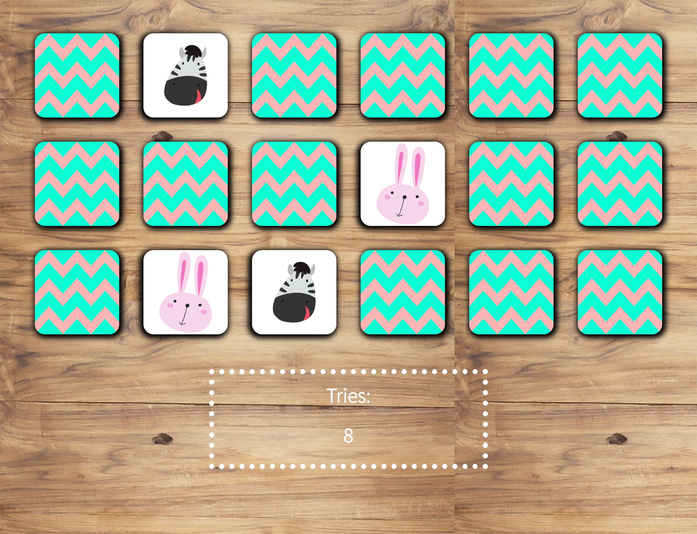

# Memory Card Game

This game is designed to test a user's memory. There is a deck of 18 cards, with 9 pairs of matching cards each.

## Instructions

* Click on a card
* Keep revealing cards and try to match up the pairs in as little tries as possible
* Try beating the existing highscore

## Skills

I used DOM manipulation with vanilla JavaScript to alter the HTML. I styled the game using Sass.

* The game is shuffled each time the window is refreshed.
* The player can see a counter showing the number of tries as well as a display of the current highscore.
* A pop-up window shows up once the player wins the game. The player can see whether they beat the highscore or not. The player can then reset the game and play again.

